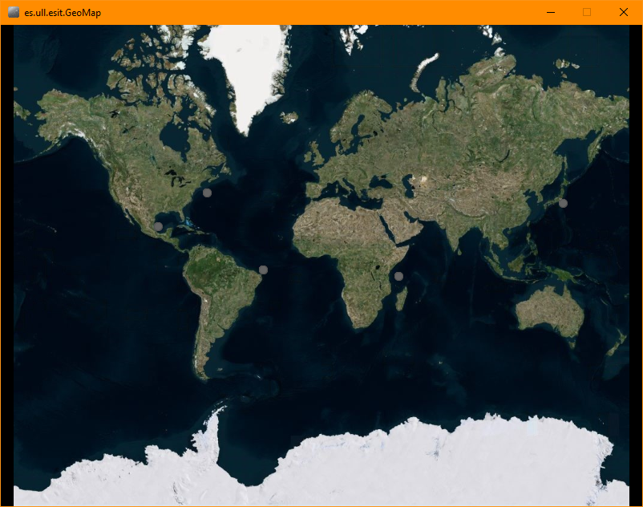

<!-- SHIELDS -->
[](https://travis-ci.com/github/alu0101109251/radarLDH)

[](https://sonarcloud.io/dashboard?id=alu0101109251_radarLDH)

[](https://travis-ci.com/alu0101109251/radarLDH)

[](https://github.com/alu0101109251/radarLDH/blob/main/LICENSE)

[](https://sonarcloud.io/dashboard?id=alu0101109251_radarLDH)
[](https://sonarcloud.io/dashboard?id=alu0101109251_radarLDH)
[](https://sonarcloud.io/dashboard?id=alu0101109251_radarLDH)
[](https://sonarcloud.io/dashboard?id=alu0101109251_radarLDH)
[](https://sonarcloud.io/dashboard?id=alu0101109251_radarLDH)
[](https://sonarcloud.io/dashboard?id=alu0101109251_radarLDH)
[](https://sonarcloud.io/dashboard?id=alu0101109251_radarLDH)
[](https://sonarcloud.io/dashboard?id=alu0101109251_radarLDH)
[](https://sonarcloud.io/dashboard?id=alu0101109251_radarLDH)

<!-- TABLE OF CONTENTS -->
## Table of Contents

- [1. About The Project](#about-the-project)
    * [Built With](#built-with)
- [2. Getting Started](#getting-started)
    * [Prerequisites](#prerequisites)
    * [Installation](#installation)
- [3. Usage](#usage)
- [4. Contributing](#contributing)
- [5. Licence](#license)
- [6. Contact](#contact)
- [7. Acknowledgements](#acknowledgements)

<!-- ABOUT THE PROJECT -->
## About The Project

Project development of a maritime tracking application.


### Built With

These are the major frameworks which have been used to build the project.
* [Maven](https://maven.apache.org/)
* [Unfolding Maps](http://unfoldingmaps.org/)
* [Doxygen](https://www.doxygen.nl/)


<!-- GETTING STARTED -->
## Getting Started

This is an example of how you may give instructions on setting up your project locally.
To get a local copy up and running follow these simple example steps.

### Prerequisites

* You will need a Java IDE such as Eclipse or IntelliJ IDEA (recommended) to open the project properly.
* Maven will be necessary for managing dependencies.

### Installation

1. Clone the repo
   ```sh
   git clone https://github.com/alu0101109251/radarLDH.git
   ```
2. Open the project and let Maven download necessary dependencies. You can also run:
   ```sh
   mvn install
   ```

<!-- USAGE EXAMPLES -->
## Usage

There are 2 different main program simulations.

1. [ConsoleMain](src/main/java/es/ull/esit/ConsoleMain.java): simulates ships tracking showing output in the console.
    * Open the Project and run ConsoleMain configuration.
    * You will start seeing the current location of different types of maritime transports, which is updated automatically.
    * If you desired more transports per type, just edit ``N_TRANSPORT`` constant.
    * Output should be as follows:
        ```shell
        Transport{type='CruiseShip', currentLocation=Point2D.Double[21.556180975655383, -95.94505098870872]}
        Transport{type='Freighter', currentLocation=Point2D.Double[34.61287103576895, 141.16457334944732]}
        Transport{type='OilTanker', currentLocation=Point2D.Double[-2.89591353110801, -34.85555343154154]}
        ```
    
2. [GeoMap](src/main/java/es/ull/esit/GeoMap.java): simulates ship tracking showing output in a geographical map.
    * Open the Project and run GeoMap configuration.
    * You will start seeing markers for each transport, which are updated automatically.
    * If you desired more transports per type, just edit ``N_TRANSPORT`` constant.
    * Output should be as follows:
      

_For more examples, please refer to the [Documentation](https://alu0101109251.github.io/radarLDH/)_


<!-- CONTRIBUTING -->
## Contributing

Contributions are what make the open source community such an amazing place to learn, inspire, and create. Any contributions you make are **greatly appreciated**.

1. Fork the Project
2. Create your Feature Branch (`git checkout -b feature/AmazingFeature`)
3. Commit your Changes (`git commit -m 'Add some AmazingFeature'`)
4. Push to the Branch (`git push origin feature/AmazingFeature`)
5. Open a Pull Request


<!-- LICENSE -->
## License

Distributed under the MIT License. See `LICENSE` for more information.


<!-- CONTACT -->
## Contact

* Javier Alonso Delgado - alu0101109251@ull.edu.es
* Adrián Ruiz Olivero - alu0101106748@ull.edu.es
* Joane Mannion Aguirre - alu0101451701@ull.edu.es

Project Link: [https://github.com/alu0101109251/radarLDH](https://github.com/alu0101109251/radarLDH)


<!-- ACKNOWLEDGEMENTS -->
## Acknowledgements
* [SonarCloud](https://sonarcloud.io/)
* [Travis CI](https://travis-ci.org/)
* [Img Shields](https://shields.io)
* [Choose an Open Source License](https://choosealicense.com)
